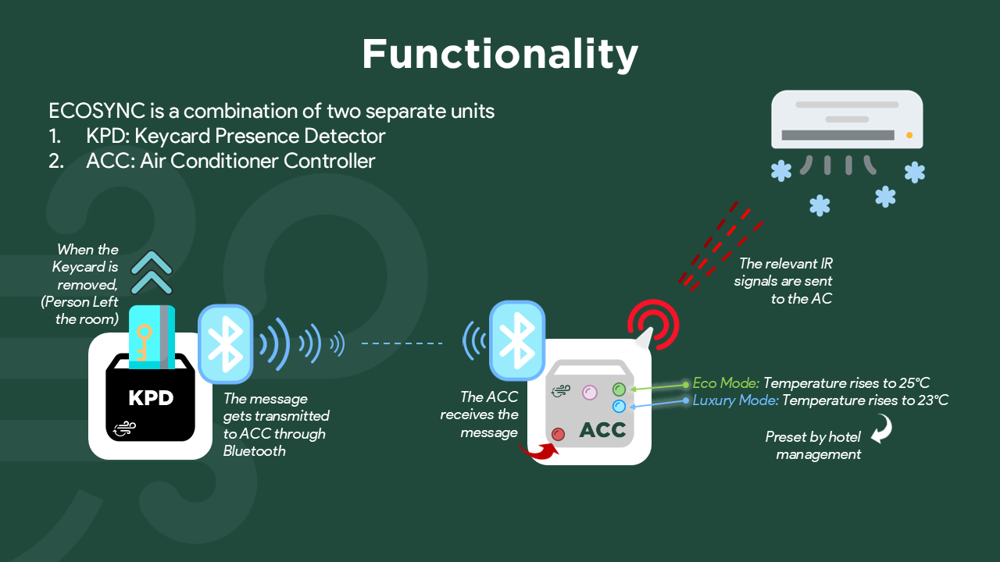
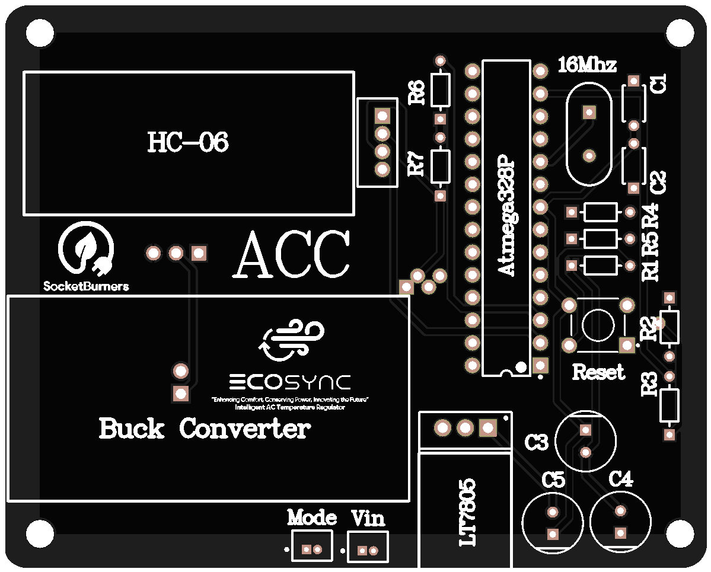
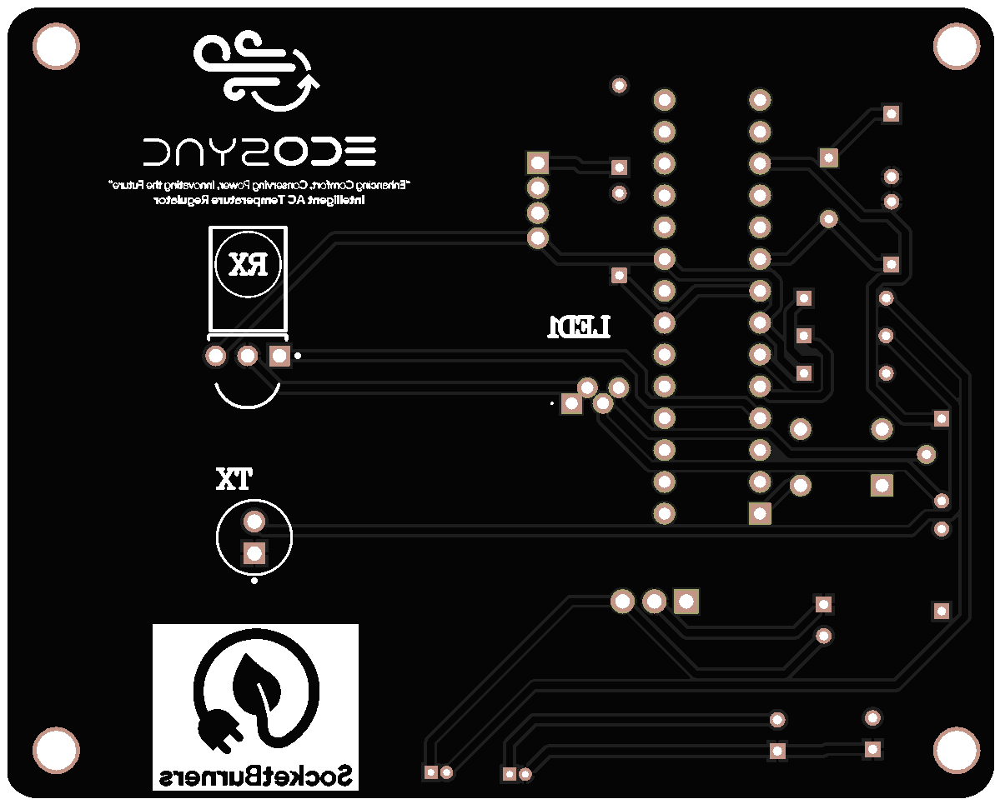
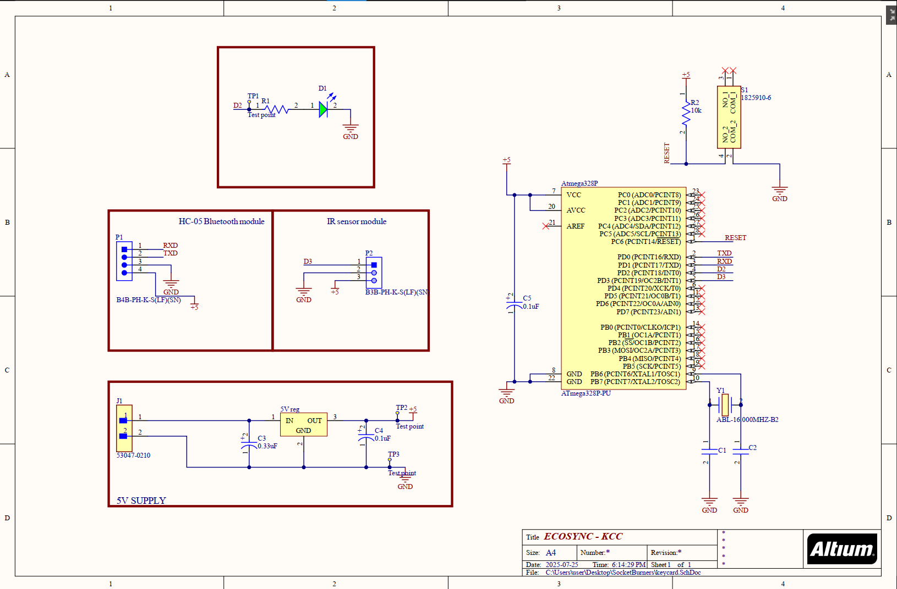
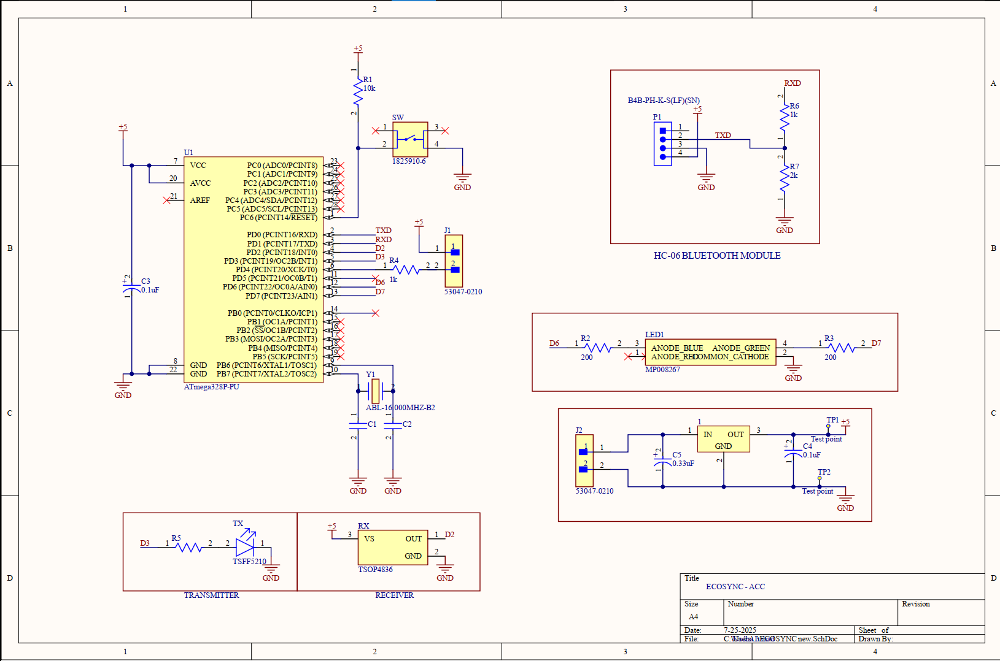
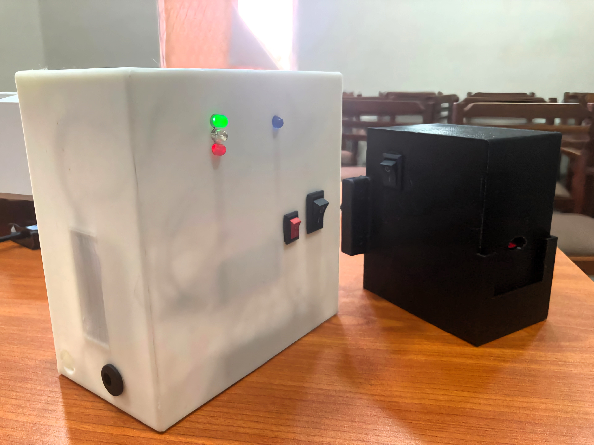
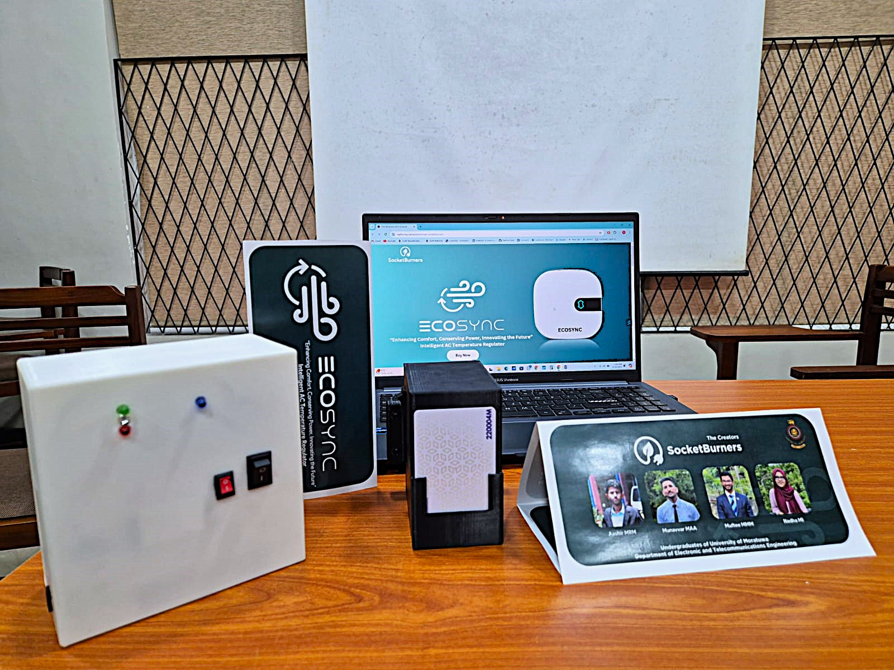

  

<h1 align="center">ECOSYNC</h1>
<h3 align="center">An Automated Intelligent AC Temperature Regulator</h3>

  
   
  <strong>Team SocketBurners – University of Moratuwa</strong>

---

## 🌿 Overview

**ECOSYNC** is an intelligent AC temperature regulator designed for hotel rooms. It dynamically adjusts the air conditioning temperature based on room occupancy, optimising energy usage without compromising guest comfort.

The system uses a **Keycard Presence Detector (KPD)** to detect guest presence and a paired **Air Conditioner Controller (ACC)** to communicate with the AC unit using IR signals. Together, they enable room-level energy conservation in real-time, providing fully automated control.

---

## 🔧 Key Features

- 🔌 IR-based AC control for most commercial brands
- 📶 Bluetooth communication between modules (HC-05 & HC-06)
- 🧠 Embedded control using ATmega328P-PU microcontrollers
- 🛠️ Fully custom PCBs (Altium), housed in 3D printed enclosures
- 🧩 Modular design: KPD and ACC work as standalone units or as a system
- 🌡️ Two preset energy modes: 25°C (Eco) and 23°C (Luxury)

---

## ⚙️ Functionality

The system works as follows:

1. Guest removes the keycard → KPD detects absence.
2. KPD transmits a signal via Bluetooth to the ACC.
3. ACC sends IR signals to increase the room temperature.
4. When the guest returns, normal AC behaviour resumes.

  

---

## 🧩 Printed Circuit Boards

### 🔷 Keycard Presence Detector (KPD)

- **Top View**  
  

- **Bottom View**  
  

---

### 🔶 AC Controller (ACC)

- **Top View**  
  

- **Bottom View**  
  

---

## 🗂️ Schematics

- **KPD Schematic**  
  

- **ACC Schematic**  
  

---

## 🖼️ Final Prototype Photos

- **Assembled Devices**

  
  

---

## Experience

We began this project during our **second semester**, starting with basic concepts and gradually building a working prototype.  

- We **visited Sophia Hotel in Colombo** to gather real user observations and insights from their maintenance engineers.  
- Our **initial design faced dimension issues**, which taught us valuable lessons in hardware integration and enclosure design.  
- We redesigned the PCBs and casing to create a **robust and reliable second-generation prototype**.  
- The project involved many **overnight development sessions**, balancing technical work and team coordination.  

---

## 🏆 Awards & Achievements

- 🥈 **1st Runner-up** – IESL Techno Spark Startup Competition 2024  
- 🥈 **1st Runner-up** – GAP Circularity Challenge 2025 (Organized by INSEE)  
- 🥉 **2nd Runner-up** – Future Innovators Challenge 2025 (IEEE Student Branch, UoM)  
- 🏆 **Most Popular Innovation** – Future Innovators Challenge 2025 (IEEE Student Branch, UoM)  
- 🎖️ **Finalists** – IESE Grant Scheme 2025  

---

## 🎬 Demo Video & Website

- 📹 **Watch the Full Demo Video:**  
  🔗 [ECOSYNC Demo Video](https://drive.google.com/file/d/1JfGw0Y93dIrog_j1LMHH4Kcrz3Ky19dq/view?usp=sharing)

- 🌐 **Visit Our Project Website:**  
  🔗 [ECOSYNC Website](https://nadha.my.canva.site/ecosyn-socketburners)

---

## 👤 My Role

- 👥 Leading and managing the team  
- 🛠️ PCB design (KPD & ACC)  
- 🎨 Brand designing and identity creation  
- 💼 Business pitching and strategy  

---

## 🧑‍💻 Team & Credits

**Team:** SocketBurners  
3rd Year Electronics & Telecommunication Engineering Undergraduates  
**University of Moratuwa**

  
   
  <em>Team SocketBurners</em>

---

  <em>Built for energy efficiency. Engineered by SocketBurners.</em>

